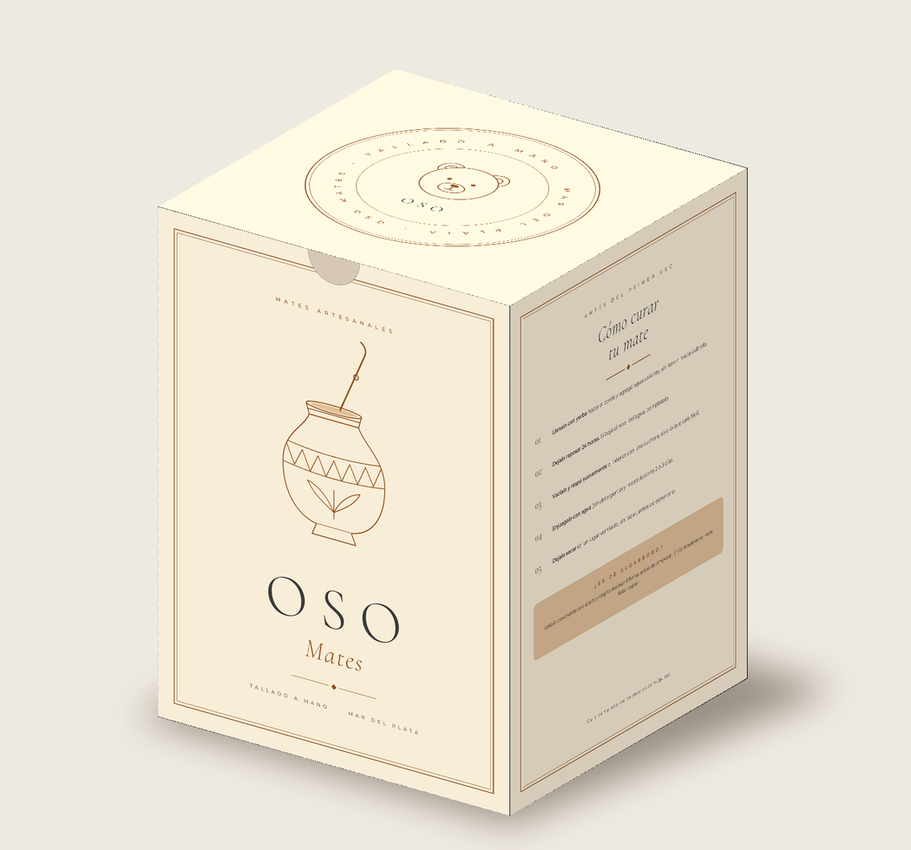

# Caja Oso Mates — 15 × 15 × 20 cm

## Archivos

| Archivo | Para qué |
|---|---|
| `caja-oso-mates-15x15x20_IMPRENTA.pdf` | **El que se manda a la imprenta.** Pág. 1: arte + troquel. Pág. 2: troquel con cotas. |
| `caja-oso-mates-15x15x20_PREVIEW.pdf` / `_DESPLEGADO.png` | Vista del desplegado recortado (solo para mirar). |
| `caja-oso-mates-15x15x20_MOCKUP.png` | Cómo queda la caja armada. |
| `generar.py`, `mockup.py`, `fonts/` | Fuente editable: cambiá textos o medidas y corré `python3 generar.py`. |

## Ficha técnica

- **Modelo:** caja de tapas invertidas (reverse tuck end), una pieza, con solapa de pegado lateral.
- **Medidas interiores:** 150 × 150 × 200 mm (frente × profundidad × alto).
- **Desplegado:** 615 × 530 mm → entra en un pliego 70 × 100 cm (1 caja por pliego).
- **Color:** CMYK, sangrado 3 mm. Texto chico solo en negro (K) para evitar problemas de registro.
- **Troquel:** tintas planas `CutContour` (corte, magenta continuo) y `Crease` (hendido, cian punteado), en sobreimpresión. No se imprimen.
- **Tipografías:** Cormorant Garamond y Montserrat, incrustadas (las de la web).
- **Solapa de pegado:** sin tinta, para que el adhesivo agarre bien.
- **Muesca para el pulgar** en la boca del frente, para abrir la tapa fácil.
- **QR:** lleva a https://osomates.com.

## Qué pedirle a la imprenta

- **Material sugerido:** cartulina duplex o triplex de 350–400 g (o microcorrugado E si querés más protección para envío).
- **Terminación sugerida:** laminado mate o barniz sectorizado (dejar la solapa sin barniz).
- Pediles que **ajusten el troquel al espesor del material** (normalmente suman 1–2 mm en los paneles) y que te manden una **prueba de color / prueba digital** antes de imprimir la tirada.
