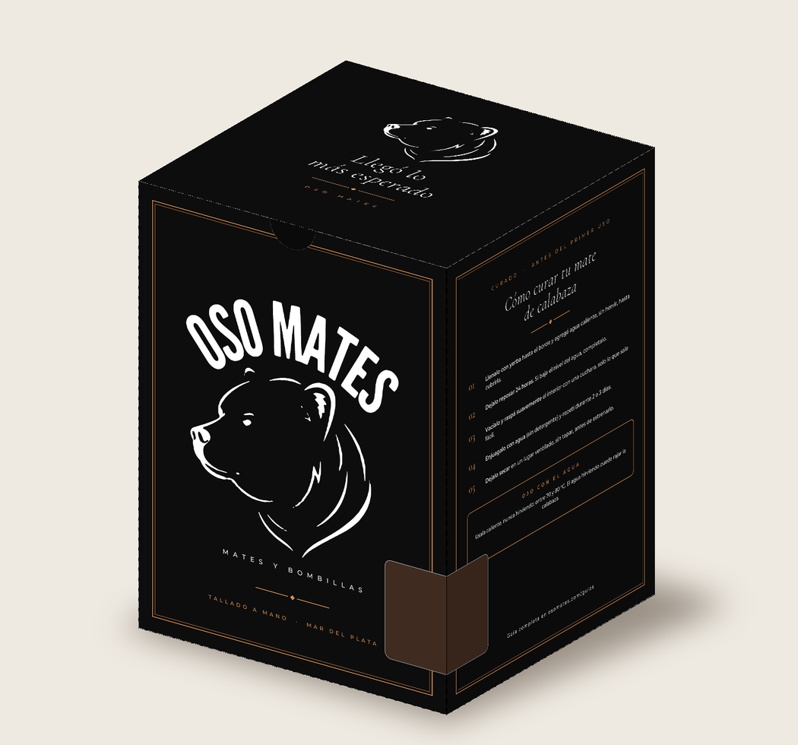
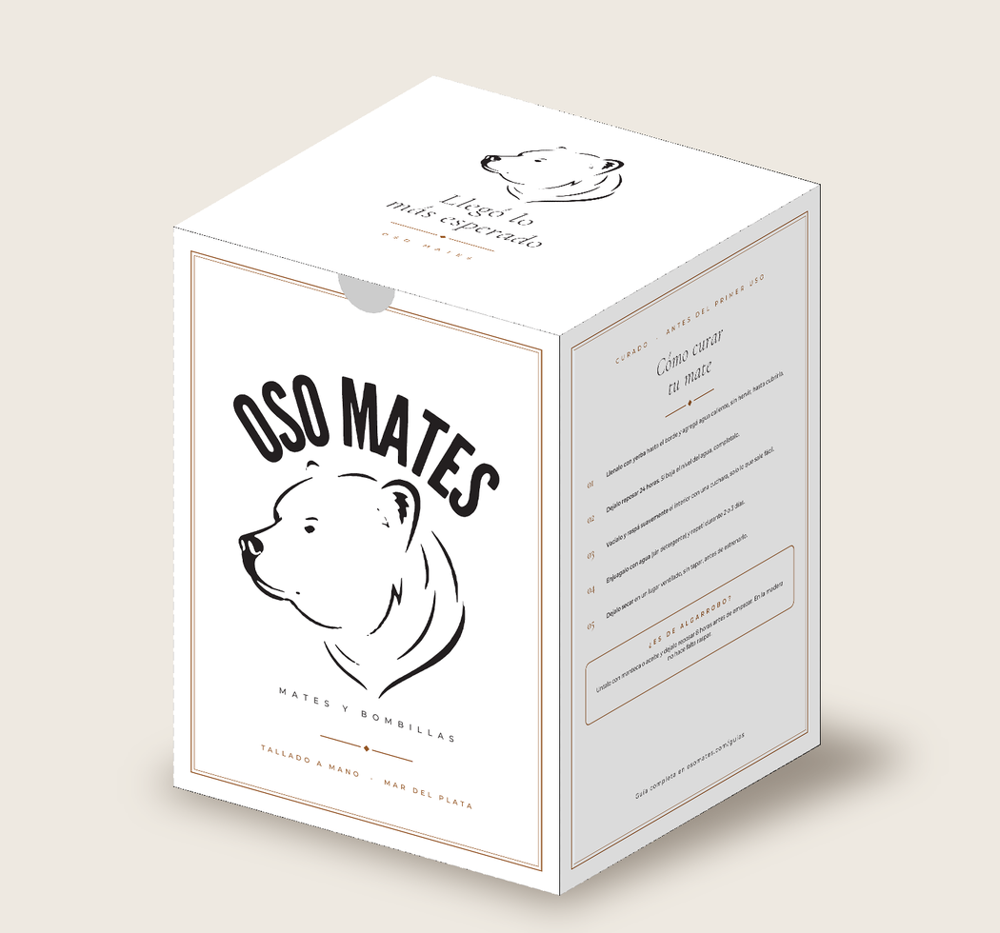
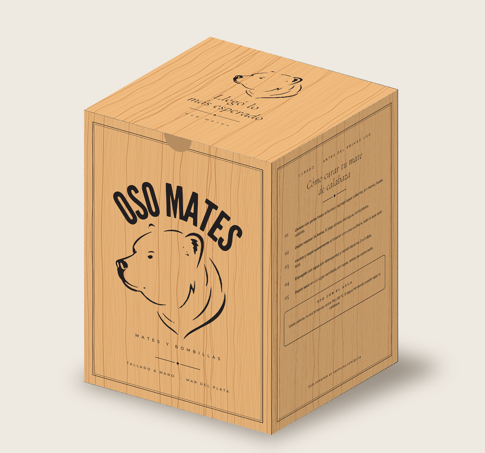

# Caja Oso Mates — 15 × 15 × 20 cm

## Archivos

| Archivo | Para qué |
|---|---|
| `caja-oso-mates-15x15x20_NEGRA_IMPRENTA.pdf` / `_BLANCA_` / `_MADERA_` | **El que se manda a la imprenta** (uno por versión). Pág. 1: arte + troquel. Pág. 2: troquel con cotas. |
| `*_PREVIEW.pdf` / `*_DESPLEGADO.png` | Vista del desplegado recortado (solo para mirar). |
| `*_MOCKUP.png` | Cómo queda la caja armada. |
| `logo-original.png`, `vectorizar_logo.py`, `logo_paths.json` | Logo del oso y su versión vectorizada (potrace). Si tenés el logo en vector original (.ai/.svg/.pdf), conviene reemplazarlo. |
| `generar.py`, `mockup.py`, `fonts/` | Fuente editable: cambiá textos o medidas y corré `python3 generar.py` y `python3 mockup.py`. |

## Contenido de la caja

- **Frente:** logo Oso Mates (oso + texto en arco), "Mates y bombillas", "Tallado a mano · Mar del Plata".
- **Tapa:** el oso + **"Llegó lo más esperado"**.
- **Lateral derecho:** **curado del mate de calabaza** paso a paso.
- **Dorso:** "Cada mate es único", QR a osomates.com, @oso_mates.
- **Lateral izquierdo:** **curado del mate de algarrobo** paso a paso.
- **Base:** "Producto artesanal".

## Ficha técnica

- **Modelo:** caja de tapas invertidas (reverse tuck end), una pieza, con solapa de pegado lateral.
- **Medidas interiores:** 150 × 150 × 200 mm (frente × profundidad × alto).
- **Desplegado:** 615 × 530 mm → entra en un pliego 70 × 100 cm (1 caja por pliego).
- **Color:** CMYK, sangrado 3 mm.
  - *Negra:* fondo negro enriquecido C60 M40 Y40 K100, textos calados en blanco, acento caramelo.
  - *Blanca:* papel blanco sin fondo, texto solo en negro (K) y acento marrón.
  - *Madera:* fondo madera clara con veta vectorial sutil, todos los detalles en negro (K100).
- **Troquel:** tintas planas `CutContour` (corte, magenta continuo) y `Crease` (hendido, cian punteado), en sobreimpresión. No se imprimen.
- **Tipografías:** Cormorant Garamond y Montserrat, incrustadas (las de la web).
- **Solapa de pegado:** sin tinta, para que el adhesivo agarre bien.
- **Muesca para el pulgar** en la boca del frente, para abrir la tapa fácil.
- **QR:** lleva a https://osomates.com.

## Qué pedirle a la imprenta

- **Material sugerido:** cartulina duplex o triplex de 350–400 g (o microcorrugado E si querés más protección para envío).
- **Terminación sugerida:** laminado mate o barniz sectorizado (dejar la solapa sin barniz).
- **Caja negra:** el laminado mate es casi obligatorio: evita que se marquen las huellas y que se vea el blanco del cartón cuando se quiebra en los dobleces.
- Pediles que **ajusten el troquel al espesor del material** (normalmente suman 1–2 mm en los paneles) y que te manden una **prueba de color / prueba digital** antes de imprimir la tirada.
