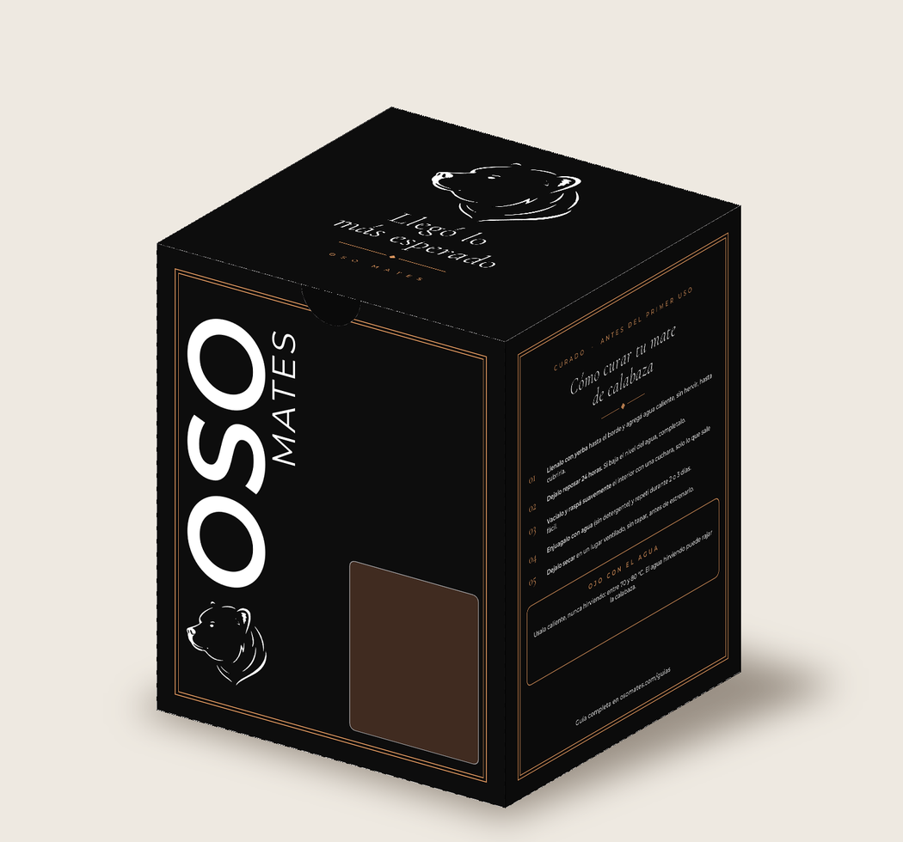
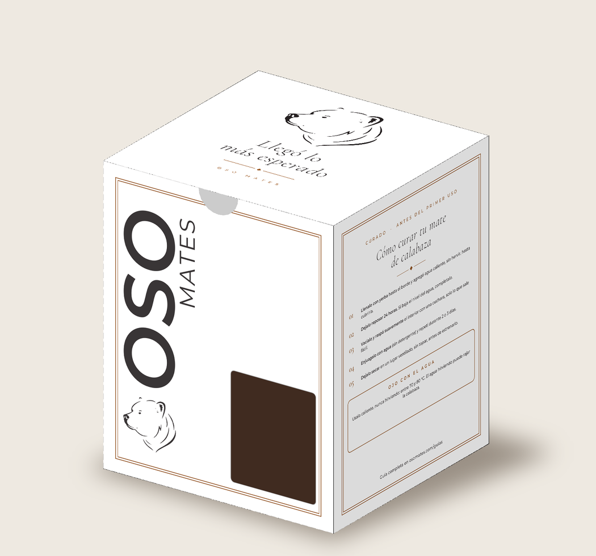
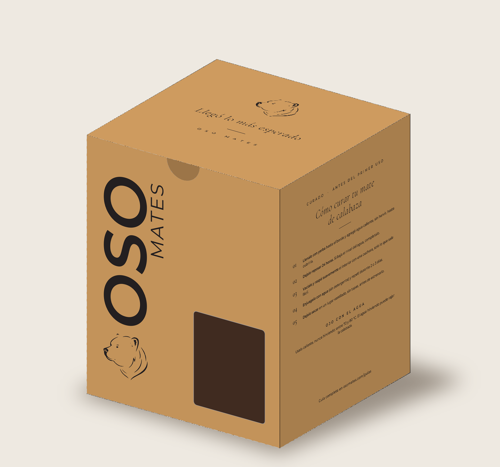

# Caja Oso Mates — 13 × 13 × 16 cm

## Archivos

| Archivo | Para qué |
|---|---|
| `caja-oso-mates-13x13x16_NEGRA_IMPRENTA.pdf` / `_BLANCA_` / `_MADERA_` / `_KRAFT_` | **El que se manda a la imprenta** (uno por versión). Pág. 1: arte + troquel. Pág. 2: troquel con cotas. |
| `*_PREVIEW.pdf` / `*_DESPLEGADO.png` | Vista del desplegado recortado (solo para mirar). |
| `*_MOCKUP.png` | Cómo queda la caja armada. |
| `logo-original.png`, `vectorizar_logo.py`, `logo_paths.json` | Logo del oso y su versión vectorizada (potrace). Si tenés el logo en vector original (.ai/.svg/.pdf), conviene reemplazarlo. |
| `generar.py`, `mockup.py`, `fonts/` | Fuente editable: cambiá textos o medidas y corré `python3 generar.py` y `python3 mockup.py`. |

## Contenido de la caja

- **Frente:** "OSO" grande en vertical con "MATES" al lado y el oso al pie; ventana a la derecha.
- **Tapa:** el oso + **"Llegó lo más esperado"**.
- **Lateral derecho:** **curado del mate de calabaza** paso a paso.
- **Dorso:** "Cada mate es único", QR a osomates.com, @oso_mates.
- **Lateral izquierdo:** **curado del mate de algarrobo** paso a paso.
- **Base:** "Producto artesanal".

## Ficha técnica

- **Modelo:** caja de tapas invertidas (reverse tuck end), una pieza, con solapa de pegado lateral.
- **Medidas interiores:** 130 × 130 × 160 mm (frente × profundidad × alto). Se cambian en `generar.py` (`L`, `W`, `H`).
- **Desplegado:** 535 × 450 mm → entran **2 cajas por pliego 70 × 100 cm**.
- **Color:** CMYK, sangrado 3 mm.
  - *Negra:* fondo negro enriquecido C60 M40 Y40 K100, textos calados en blanco, acento caramelo.
  - *Blanca:* papel blanco sin fondo, texto solo en negro (K) y acento marrón.
  - *Madera (minimalista):* fondo color kraft liso (C8 M30 Y55 K18) impreso en CMYK, sin marcos; frente con el oso chico + "OSO MATES". Detalles en negro (K100).
  - *Kraft:* mismo diseño, **solo tinta negra** para imprimir sobre cartón kraft real (sin fondo impreso). Es la opción más barata y la que más se parece a una caja de cartón natural.
- **Troquel:** tintas planas `CutContour` (corte, magenta continuo) y `Crease` (hendido, cian punteado), en sobreimpresión. No se imprimen.
- **Tipografías:** Cormorant Garamond y Montserrat, incrustadas (las de la web).
- **Solapa de pegado:** sin tinta, para que el adhesivo agarre bien.
- **Muesca para el pulgar** en la boca del frente, para abrir la tapa fácil.
- **Ventana** rectangular en la mitad derecha del frente, abajo (48 mm de ancho × 58 mm de alto, a 12 mm de la base y 10 mm del borde), para ver el mate. Va en el troquel como corte (CutContour).
- **QR:** lleva a https://osomates.com.

## Qué pedirle a la imprenta

- **Material sugerido:** cartulina duplex o triplex de 350–400 g (o microcorrugado E si querés más protección para envío).
- **Terminación sugerida:** laminado mate o barniz sectorizado (dejar la solapa sin barniz).
- **Caja negra:** el laminado mate es casi obligatorio: evita que se marquen las huellas y que se vea el blanco del cartón cuando se quiebra en los dobleces.
- Pediles que **ajusten el troquel al espesor del material** (normalmente suman 1–2 mm en los paneles) y que te manden una **prueba de color / prueba digital** antes de imprimir la tirada.
